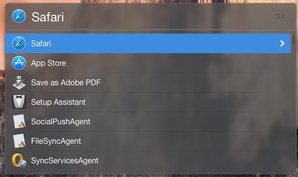

Yosemite-Dark.lbtheme
=====================

### A Sleek Dark theme for Launch Bar 6

## Looks

## Installation

To add the theme to Launch Bar 6, simply download the [zip][zip] for this repo.
Unzip the file. You'll need to remove `-master` from the folder name for OS X to correctly recognize the package. Then simply double click and Launch Bar will install the theme! 

### Notes:
* Font is Helvetica Neue instead of Helvetica Neue Light because I find it a bit easier to read.
* Selection color is light blue for all selections which is partially in the Yosemite theme (which otherwise uses orange).
* The background and blur are slightly lighter and less blurry than default Launch Bar themes to (hopefully) more close match the default Yosemite look.

### Credits

Pretty much all the hard work goes to Objective Development for actually creating the initial themes in Launch Bar! I've merely taken what they've done and added my own twists. :)

Thanks for the awesome app!

### Pull Requests

Feel free to send a pull request, but please provide an image to show what looks differently. I may not accept every pull request, but I'd love to see what you think.